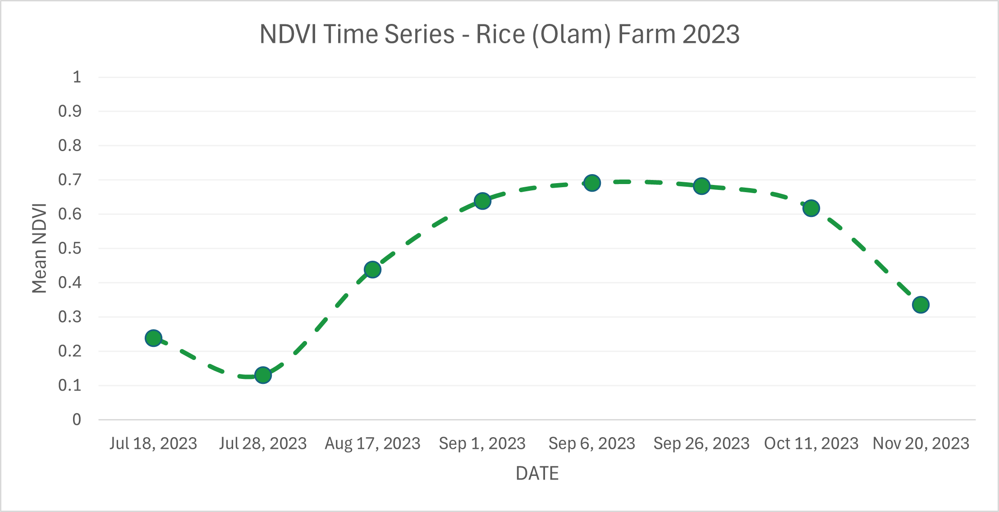
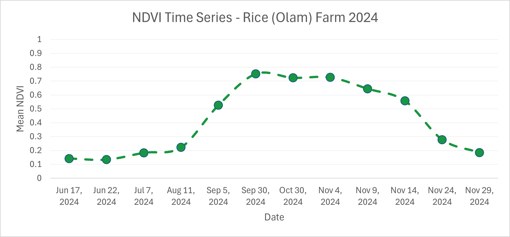
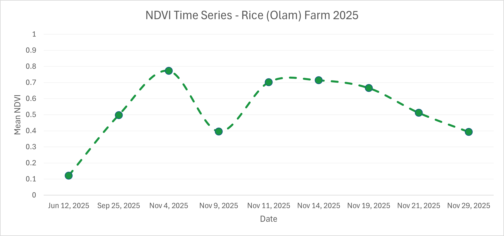
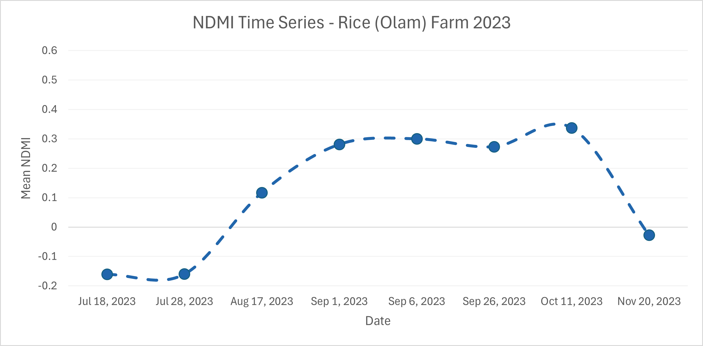
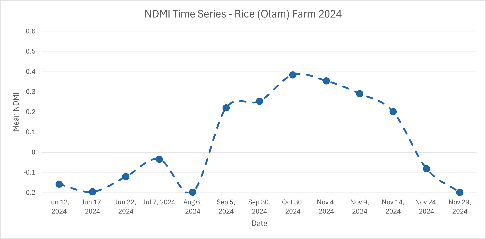
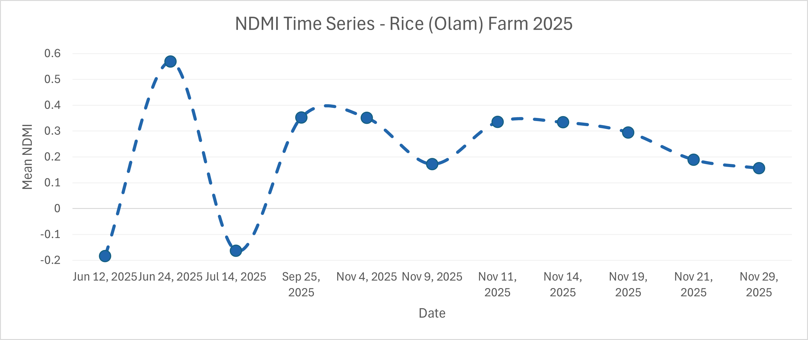

# Satellite-Based Monitoring of Vegetation Health and Moisture Dynamics
## A Commercial Rice Farm, Nassarawa State, Nigeria (2023–2025)


## Overview
This project presents a multi-temporal satellite-based analysis of vegetation 
health and canopy moisture dynamics at a commercial rice farm in Nassarawa 
State, Nigeria. Using freely available Sentinel-2 imagery processed through 
Google Earth Engine, the study computes and analyses the Normalised Difference 
Vegetation Index (NDVI) and Normalised Difference Moisture Index (NDMI) across 
three consecutive growing seasons (2023, 2024, and 2025).

The farm covers approximately 61.3 hectares and is located at 7°53'N, 8°20'E 
within the Guinea Savanna agro-ecological zone of North-Central Nigeria.

---

## Objectives
- Map the spatial distribution of vegetation health and moisture conditions 
  across the farm at seasonal scale
- Track temporal dynamics of crop development through full-season time series 
  analysis
- Assess inter-annual trends in farm performance using satellite-derived evidence

---

## Study Area
**Location:** Akpetche, Nassarawa State, Nigeria  
**Coordinates:** 7°53'N, 8°20'E  
**Farm Size:** 61.3 hectares  
**Crop:** Rice (single annual season)  
**Season Window:** June – November  


---

## Data and Tools
| Item | Details |
|------|---------|
| Satellite Data | Sentinel-2 SR Harmonised (Copernicus) |
| Platform | Google Earth Engine (JavaScript API) |
| Indices | NDVI, NDMI |
| Spatial Resolution | 10 metres |
| CRS | EPSG:32632 — WGS84 UTM Zone 32N |
| Cartography | QGIS 3.40 Bratislava |
| Soil Data | iSDAsoil Africa v1 (30m) |
| Analysis Period | 2023, 2024, 2025 growing seasons |

---

## Methodology
1. Sentinel-2 SR imagery filtered to farm boundary and season window
2. Cloud masking using Scene Classification Layer (SCL) at pixel level
3. NDVI and NDMI computed per image
4. Seasonal median composites generated for spatial mapping
5. Full-season time series extracted for temporal analysis
6. Spatial statistics (min, max, mean) extracted per season
7. Soil texture characterised using iSDAsoil dataset

---

## Key Results

### NDVI Summary Statistics
| Season | Min | Max | Mean |
|--------|-----|-----|------|
| 2023 | 0.064 | 0.901 | 0.554 |
| 2024 | 0.126 | 0.760 | 0.559 |
| 2025 | 0.191 | 0.812 | 0.706 |

### NDMI Summary Statistics
| Season | Min | Max | Mean |
|--------|-----|-----|------|
| 2023 | -0.222 | 0.423 | 0.213 |
| 2024 | -0.182 | 0.413 | 0.208 |
| 2025 | -0.112 | 0.435 | 0.330 |

### Soil Characterisation (iSDAsoil, 0–20cm)
| Property | Value |
|----------|-------|
| Sand | 45.9% |
| Silt | 25.7% |
| Clay | 29.3% |
| pH | 6.2 |
| Texture Class | Sandy Clay Loam |

---

## NDVI Maps
| 2023 | 2024 | 2025 |
|------|------|------|
|  |  |  |

---

## NDMI Maps
| 2023 | 2024 | 2025 |
|------|------|------|
|  |  |  |

---

## Time Series Charts

### NDVI Time Series
| 2023 | 2024 | 2025 |
|------|------|------|
|  |  |  |

### NDMI Time Series
| 2023 | 2024 | 2025 |
|------|------|------|
|  |  |  |

---

## Key Findings
- Peak NDVI increased progressively across seasons: 0.691 (2023), 
  0.752 (2024), 0.773 (2025)
- Mean NDVI jumped significantly in 2025 (0.706) relative to 2023 
  (0.554) and 2024 (0.559), indicating improved spatial uniformity 
  of canopy development
- NDMI confirmed expected seasonal moisture trajectory in all three 
  years, with negative values at transplanting rising to positive 
  peaks at canopy closure
- A consistent NDVI-NDMI lag of 2–4 weeks was observed across all 
  seasons, reflecting the progression from maximum greenness through 
  grain filling
- A persistent stress zone was identified in the central section of 
  the farm in 2024, where co-located low NDVI and NDMI values indicate 
  a site-specific constraint

---

## Report
The full project report is available in the [Report](Report/) folder.

---

## Repository Structure

```
Rice-Farm-Satellite-Analysis/
├── README.md
├── GEE_Script/
│   └── Olam_Nassarawa_Analysis.js
├── Maps/
│   ├── Study_Area_Map.png
│   ├── NDVI_2023.png
│   ├── NDVI_2024.png
│   ├── NDVI_2025.png
│   ├── NDMI_2023.png
│   ├── NDMI_2024.png
│   └── NDMI_2025.png
├── Charts/
│   ├── NDVI2023.png
│   ├── NDVI2024.png
│   ├── NDVI2025.png
│   ├── NDMI2023.png
│   ├── NDMI2024.png
│   └── NDMI2025.png
└── Report/
    └── Rice_Farm_Report.pdf
```

---

## Author
**Adeneye Timothy (Bloom)**  
Remote Sensing & GIS Analyst  
📍 Nigeria  
🔗 [GitHub](https://github.com/Bloom9ja)  

---

## Acknowledgements
Satellite imagery: Copernicus Sentinel-2, accessed via Google Earth Engine  
Soil data: iSDAsoil Africa v1  
Basemap: Google Satellite  
Administrative boundaries: GeoBoundaries NGA
